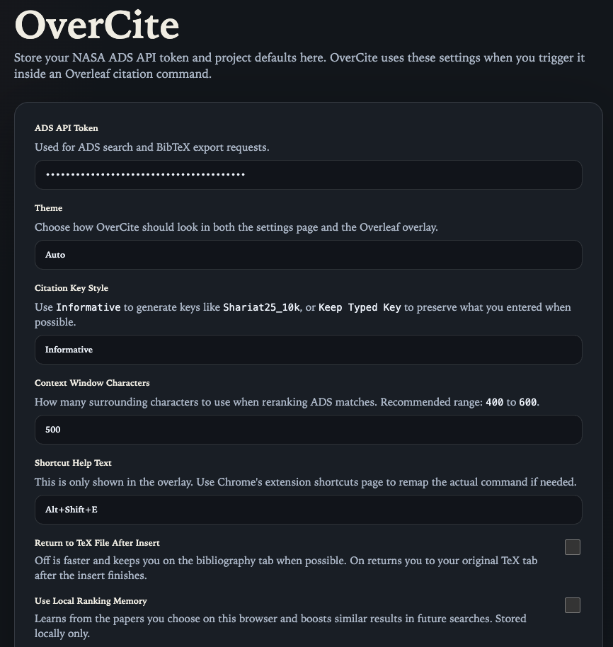

# OverCite

OverCite is a Chromium extension for Overleaf that searches NASA ADS from inside LaTeX citation commands, shows likely paper matches, and inserts BibTeX into the correct project bibliography file.

## Repository layout

- `extension/`: loadable Chrome extension source
- `docs/`: technical report and PDF overview
- `example_tex/`: example Overleaf-style project for testing

## Quick start

1. Open `chrome://extensions`
2. Turn on Developer mode
3. Click `Load unpacked`
4. Select `extension/`
5. Open the OverCite options page
6. Paste your NASA ADS API token*
7. Open an Overleaf project and trigger OverCite inside `\cite{...}`

*sign in to [NASA ADS](https://ui.adsabs.harvard.edu/), go to Account --> Settings --> API Token

## Settings

OverCite keeps the UI simple and puts the main behavior controls in the extension settings page.



Current settings include:

- ADS API token for NASA ADS search access
- Theme selection
- Citation key style, including keeping the typed key instead of adding an informative suffix
- Local ranking memory, which learns from papers you select and uses that to improve future ranking
- Project-specific bibliography file overrides when a project contains multiple `.bib` files

## Local testing

```bash
cd extension
npm test
```

## Documentation

- Technical report: [docs/OverCite_technical_report.md](docs/OverCite_technical_report.md)
- PDF report: [docs/OverCite_technical_report.pdf](docs/OverCite_technical_report.pdf)

## Notes

- OverCite works with arbitrary `.bib` file names and is not limited to `references.bib`.
- The current implementation is deterministic and does not require an LLM.
