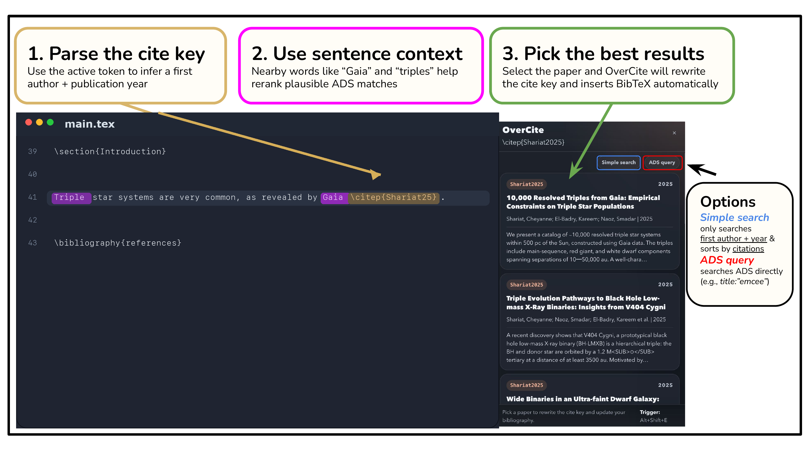

# OverCite

Type rough citation key -> press shortcut -> choose paper -> OverCite inserts BibTeX.

all without leaving the editor
<!--By default, the tool queries NASA ADS/SciX, finds papers, and inserts the selected BibTeX entry into the project .bib file. You can keep that fast ADS/SciX-only behavior or turn on broader source presets for fields such as CS, math, physics, and life sciences. It's available as a browser extension (for Overleaf) or a VS Code extension (for local projects).-->

To download,  
1. search for `OverCite` in the extensions store or marketplace ([Chrome](https://chromewebstore.google.com/detail/overcite/hmjojciemhnfkjnilakhehkgkhkplbdo), [Firefox](https://addons.mozilla.org/en-US/firefox/addon/overcite/?utm_source=addons.mozilla.org&utm_medium=referral&utm_content=search), [VSCode](https://marketplace.visualstudio.com/items?itemName=CheyanneShariat.overcite-vscode)). 
2.  paste your NASA ADS/SciX *API token* in the OverCite extension settings 
    
    (to get your token, sign in to [NASA ADS](https://ui.adsabs.harvard.edu/) or [SciX](https://scixplorer.org/),  Settings -> API token).
3. Get citing! To get started, try citing one of your own (or your colleagues) papers; default command is `Alt+Shift+E`.

- Chrome: [Chrome Web Store](https://chromewebstore.google.com/detail/overcite/hmjojciemhnfkjnilakhehkgkhkplbdo)
- Firefox: [Firefox Add-ons](https://addons.mozilla.org/en-US/firefox/addon/overcite/?utm_source=addons.mozilla.org&utm_medium=referral&utm_content=search)
- VS Code: [Visual Studio Marketplace](https://marketplace.visualstudio.com/items?itemName=CheyanneShariat.overcite-vscode)
- Paper: [RNAAS article](https://iopscience.iop.org/article/10.3847/2515-5172/ae5dbc) | [PDF](docs/papers/OverCite_RNAAS_2026.pdf)
- Safari: local download (beta version only)
## Attribution
If OverCite was helpful in preparing your manuscript, you can acknowledge it with:

```tex
This work made use of \texttt{\href{https://github.com/cheyanneshariat/OverCite}{OverCite}} \citep{Shariat2026}, an in-editor citation tool for \LaTeX.
```

To get the BibTex, you can just activate Overcite on `\citep{Shariat2026}` ;)

...or you can copy it here:
<details>
```bibtex
@ARTICLE{Shariat2026,
       author = {{Shariat}, Cheyanne},
        title = "{OverCite: Add Citations in LaTeX without Leaving the Editor}",
      journal = {Research Notes of the American Astronomical Society},
     keywords = {Astronomy software, Open source software, 1855, 1866, Digital Libraries, Instrumentation and Methods for Astrophysics, Human-Computer Interaction, Information Retrieval},
         year = 2026,
        month = apr,
       volume = {10},
       number = {4},
          eid = {86},
        pages = {86},
          doi = {10.3847/2515-5172/ae5dbc},
archivePrefix = {arXiv},
       eprint = {2604.15366},
 primaryClass = {cs.DL},
       adsurl = {https://ui.adsabs.harvard.edu/abs/2026RNAAS..10...86S},
      adsnote = {Provided by the SAO/NASA Astrophysics Data System}
}
```
</details>

It supports 3 search modes:

1. `Contextual` uses typed citation key + local sentence context 
2. `Simple search` searches author/year only and sorts by citation count
3. `Raw query` sends the typed token directly to the configured literature sources

Covered fields depend on the selected source preset. The default ADS/SciX-only mode is the fastest path for astronomy and physics; optional broader presets add sources such as arXiv, Crossref, DataCite, OpenAlex, PubMed, and Semantic Scholar for CS, math, biology, and cross-field papers.

## Demo
Note: the default command is `Alt+Shift+E` (can be changed in settings). Mac users: `Alt` = `option`
[](docs/assets/overcite-demo-preview-storyboard-apr25.gif)

## Install

For most users, installation is just:

1. Install OverCite from [Chrome](https://chromewebstore.google.com/detail/overcite/hmjojciemhnfkjnilakhehkgkhkplbdo), [Firefox](https://addons.mozilla.org/en-US/firefox/addon/overcite/?utm_source=addons.mozilla.org&utm_medium=referral&utm_content=search), or [VSCode](https://marketplace.visualstudio.com/items?itemName=CheyanneShariat.overcite-vscode))
2. Paste your NASA ADS/SciX API token in OverCite's settings (to get your token, sign in to [NASA ADS](https://ui.adsabs.harvard.edu/) or [SciX](https://scixplorer.org/),  Settings -> API token)
3. Get citing!

You do **not** need to clone or download this repository unless you want a local developer copy.

<details>
  <summary>Chrome</summary>

1. Install OverCite from the [Chrome Web Store](https://chromewebstore.google.com/detail/overcite/hmjojciemhnfkjnilakhehkgkhkplbdo)
   - Click `Add to Chrome`
2. Open the OverCite options page (`Details` --> `Extension options`)
3. Paste your NASA ADS or SciX API token*, click `Save Settings` at the bottom
4. Open an Overleaf project and trigger OverCite inside `\cite{...}`
5. Put the cursor inside the citation key and press `Alt+Shift+E`
   - Mac users: `Alt` means the `Option` key

</details>

<details>
  <summary>Firefox</summary>

1. Install OverCite from [Firefox Add-ons](https://addons.mozilla.org/en-US/firefox/addon/overcite/?utm_source=addons.mozilla.org&utm_medium=referral&utm_content=search)
   - Click `Add to Firefox`
2. Open the OverCite options page (`about:addons` -> `OverCite` -> `Preferences`)
3. Paste your NASA ADS or SciX API token*, click `Save Settings` at the bottom
4. Open an Overleaf project and trigger OverCite inside `\cite{...}`
5. Put the cursor inside the citation key and press `Alt+Shift+E`
   - Mac users: `Alt` means the `Option` key

</details>

<details>
  <summary>VS Code</summary>

1. Install OverCite from the [Visual Studio Marketplace](https://marketplace.visualstudio.com/items?itemName=CheyanneShariat.overcite-vscode)
   - Or open Extensions in VS Code and search for `OverCite`, then click `Install`
2. Reload VS Code if needed
3. Open a local LaTeX workspace with a `.tex` file and at least one `.bib` file
4. Open VS Code Settings:
   - Mac shortcut: `Command+,`
   - or open the Command Palette with `Command+Shift+P` and run `Preferences: Open Settings (UI)`
5. In the Settings search bar, type `OverCite`
6. Under the `Extensions` --> `OverCite` section, find `OverCite: Ads Api Token`
7. Paste your NASA ADS or SciX API token* into that field
8. Open a `.tex` file, put the cursor inside the citation key, and press `Alt+Shift+E`
9. Or use the Command Palette and run one of:
   - `OverCite: Resolve Citation`
   - `OverCite: Resolve Citation (Simple Search)`
   - `OverCite: Resolve Citation (ADS Query)`
10. Review the dropdown results and choose the paper you want

For custom VS Code shortcuts or more detailed VS Code examples, see [vscode-extension/README.md](vscode-extension/README.md).

</details>

<details>
  <summary>Safari (beta)</summary>

Safari currently lives as a local source build from this repository.

1. Clone or download this repository to your Mac
2. Open `safari/OverCite.xcodeproj` in Xcode
3. If Xcode prompts for signing, select your Apple development team for both the app and extension targets
4. Run the `OverCite` scheme, enable the extension in Safari, add your token, and try `Alt+Shift+E` in Overleaf

For full local-build instructions, see [safari/README.md](safari/README.md).

</details>

*sign in to [NASA ADS](https://ui.adsabs.harvard.edu/) or [SciX](https://scixplorer.org/), then go to your account settings and copy an API token


## How to use OverCite

1. Type a rough citation key like `\citep{Perlmutter99}` or `\citep{Schlegel}`.
2. Put the cursor on the key you want to resolve.
3. Press `Alt+Shift+E` (or remap this in your settings).
4. Review the OverCite results popup, click the paper you want.
5. That's it! OverCite will update the cite key and insert the BibTeX entry into your .bib file.



## Examples

Recommended citation patterns:

- `\citep{Shariat25}`: best default, combining first author and year
- `\citep{Abbott2016}`: also supported if you prefer a four-digit year
- `\citep{title:"emcee"}`: supports raw ADS/SciX queries when ADS is configured, just use `Raw query` mode
- `\citep{Schlegel}`: useful when you know the author but not the year

Mode examples:

- `Contextual`: `Cosmic acceleration from Type Ia supernovae remains foundational \citep{Perlmutter99}.`
- `Simple search`: `Galactic dust corrections often begin with \citep{Schlegel}.`
- `Raw query`: `Sometimes, you just need to boot up MCMC \citep{title:"emcee"}.`
- `Raw query` with ADS fields: `It's a hard day to be a primordial black hole \citep{author:"Shariat" year:2025 title:"dark matter"}.`

Note that you can set the `Default Search Mode` in the extension settings.

## Scope

OverCite works best when you already know the paper, author, or result you want to cite, and want to add it without leaving the editor. It is designed to replace the interruptive workflow of stopping, searching ADS/SciX, copying BibTeX, renaming the citation key, and then returning to writing. 

*OverCite is not meant to replace broader literature exploration or paper discovery.*

## Settings

OverCite keeps the UI simple and puts the main behavior controls in the extension settings page.

Current settings include:

- ADS/SciX API token
- Optional Semantic Scholar API key
- Optional NCBI API key for higher-rate PubMed requests
- Source preset, primary source, and optional fallback sources. `ADS/SciX only` is the default and fastest legacy behavior; broader presets search the primary source first and only use fallbacks when the top hit is not strong enough.
- Theme selection
- Citation key style, including plain author-year keys like `Perlmutter1999`, underscore keys like `Perlmutter_1999`, informative keys like `Perlmutter99_supernovae`, ADS bibcodes like `2025PASP..137i4201S`, or keeping the typed key
- Bibliography entry order, including alphabetical insertion by citation key
- Default search mode, so OverCite can open in contextual mode, simple search mode, or raw query mode first
- Project-specific bibliography file overrides (when a project contains multiple `.bib` files)

For non-empty citation keys, the popup also includes small `Simple search` and `Raw query` fallbacks. `Simple search` ignores local sentence context and reruns the lookup from the typed author/year hint alone, while `Raw query` sends the typed token directly to the configured sources.

## Documentation

- Changelog: [CHANGELOG.md](CHANGELOG.md)
- Paper: [RNAAS article](https://iopscience.iop.org/article/10.3847/2515-5172/ae5dbc)
- Paper PDF: [docs/papers/OverCite_RNAAS_2026.pdf](docs/papers/OverCite_RNAAS_2026.pdf)
- Logic flow: [docs/OverCite_logic_flow.md](docs/OverCite_logic_flow.md)
- Ranking flow: [docs/OverCite_ranking_flow.md](docs/OverCite_ranking_flow.md)
- Privacy policy: [PRIVACY.md](PRIVACY.md)

## Updating

If you install from the Chrome Web Store, Firefox Add-on page, or VS Code Marketplace, updates come through those channels automatically. Manual repo updates are only relevant for local developer installs.

<details>
  <summary>Chrome</summary>

1. Open the Chrome Web Store page for OverCite
2. Let Chrome pick up the latest published version automatically
3. If needed, refresh your Overleaf tab

</details>

<details>
  <summary>Firefox</summary>

1. Replace your local repo copy with the newer one, or `git pull`
2. Open `about:debugging#/runtime/this-firefox`
3. Remove the old temporary add-on if needed
4. Click `Load Temporary Add-on...`
5. Select `extension/dist/firefox/manifest.json` again
6. Refresh your Overleaf tab

</details>

<details>
  <summary>VS Code</summary>

1. Update OverCite through the VS Code Extensions view
2. Or reinstall from the [Visual Studio Marketplace](https://marketplace.visualstudio.com/items?itemName=CheyanneShariat.overcite-vscode)
3. Reload VS Code if needed

</details>

## Notes
- OverCite *does not* use an LLM during any part of the search/ranking.
- OverCite works with arbitrary `.bib` file names and is not limited to `references.bib`.
- The current implementation is deterministic and does not require an LLM.
- For common surnames, you can optionally include a first initial in the cite key to narrow results, for example `JSmith05`, `SmithJ05`, or `LiW25`.
- Multi-word surnames such as `Smith Jane` and `Smith Jane25` are supported.
- Collaborations such as `Planck Collaboration` and `The LIGO Collaboration25` are supported.
- Chrome and Firefox should be loaded from the generated `extension/dist/` folders, not directly from the source `extension/` manifest.
- Maintainers can regenerate those browser-specific `dist/` folders with `cd extension && npm run build`.
- If the popup gets stuck, try refreshing Overleaf and/or clicking `Reload` on the OverCite extension at `chrome://extensions/`.

## Contact
I am always happy to hear your thoughts or get any feedback! You can contact [me](https://cheyanneshariat.github.io/) at **cshariat@caltech.edu**.
