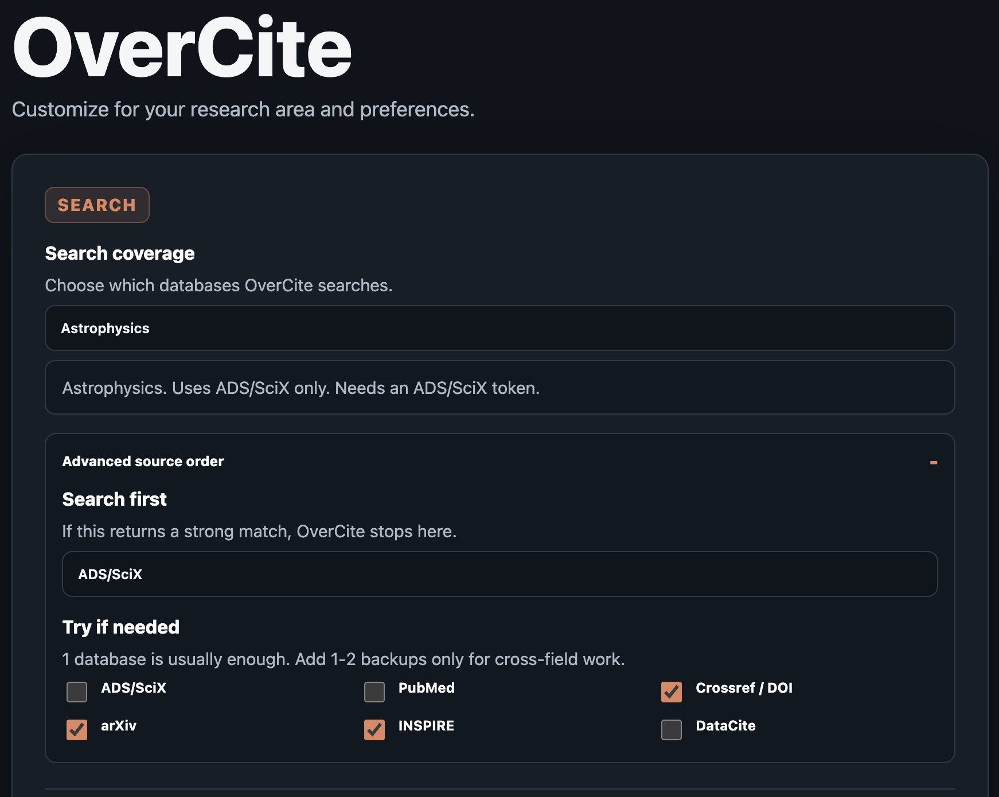

<p align="center">
  
</p>

<h1 align="center">OverCite</h1>

<h3 align="center">add citations to LaTeX without leaving your editor.</h3>

<p align="center">
  <em>Type rough citation key &rarr; press shortcut &rarr; choose paper &rarr; OverCite inserts BibTeX.</em>
</p>

<div align="center">
  <p>
    <a href="https://chromewebstore.google.com/detail/overcite/hmjojciemhnfkjnilakhehkgkhkplbdo"></a>
    <a href="https://addons.mozilla.org/en-US/firefox/addon/overcite/?utm_source=addons.mozilla.org&utm_medium=referral&utm_content=search"></a>
    <a href="https://marketplace.visualstudio.com/items?itemName=CheyanneShariat.overcite-vscode"></a>
    <a href="https://iopscience.iop.org/article/10.3847/2515-5172/ae5dbc"></a>
    <a href="LICENSE"></a>
  </p>

  <p>
    
    
    
  </p>

  <p>
    <a href="#get-started">Get Started</a> ·
    <a href="#how-to-use">How to Use</a> ·
    <a href="#examples">Examples</a> ·
    <a href="#settings">Settings</a> ·
    <a href="#acknowledge">Acknowledge</a>
  </p>
</div>

<p align="center">
  <a href="docs/assets/overcite-demo-preview-storyboard-apr25.gif">
    
  </a>
</p>

## Get Started

Install OverCite from the place where you write:

| Editor | Best install path | Notes |
| --- | --- | --- |
| Overleaf in Chrome | [Chrome Web Store](https://chromewebstore.google.com/detail/overcite/hmjojciemhnfkjnilakhehkgkhkplbdo) | Recommended for most Overleaf users |
| Overleaf in Firefox | [Firefox Add-ons](https://addons.mozilla.org/en-US/firefox/addon/overcite/?utm_source=addons.mozilla.org&utm_medium=referral&utm_content=search) | Same workflow as Chrome |
| Local LaTeX in VS Code | [Visual Studio Marketplace](https://marketplace.visualstudio.com/items?itemName=CheyanneShariat.overcite-vscode) | Uses your local `.tex` and `.bib` files |
| TeXstudio | [Local setup](texstudio/README.md) | Experimental |
| Safari | [Local build](safari/README.md) | Beta |

Then:

1. Open the OverCite settings.
2. Choose your subject area.
   - Recommended for astrophysics: add a NASA ADS/SciX API token.
   - Get one from [NASA ADS](https://ui.adsabs.harvard.edu/) or [SciX](https://scixplorer.org/): sign in -> account settings -> API token -> copy into OverCite settings.
3. Try a citation you know, such as one of your own papers or a colleague's paper.

## How to Use

The default shortcut is `Alt+Shift+E`. Mac users: `Alt` = `Option` / `⌥`.

1. Type a rough citation key like `\citep{Dirac1928}`, `\citep{Watson1953}`, or `\citep{Doudna14}`. You can also leave out the year, search for a title, or paste a DOI/arXiv id (see [Examples](#examples)).
2. Put the cursor on the key you want to resolve.
3. Press `Alt+Shift+E` (or remap this).
4. Review the OverCite results popup, click the paper you want.
5. That's it! OverCite will update the cite key and insert the BibTeX entry into your `.bib` file.


## Examples

Search modes:

1. `Contextual` uses typed citation key + local sentence context
2. `Simple search` searches author/year only and sorts by citation count
3. `Raw query` sends the typed token directly to the configured source route

Mode examples:

- `Contextual`: `CRISPR-Cas9 genome engineering became broadly programmable after \citep{Doudna14}.`
- `Contextual`: `Transformers made attention central in language modeling \citep{Vaswani17}.`
- `Contextual`: `Molecular Structure of Nucleic Acids introduced the double helix model \citep{Watson1953}.`
- `Simple search`: `The emcee sampler is widely used in astronomy \citep{Foreman-Mackey2013}.`
- `Simple search`: `Relativistic quantum mechanics follows from \citep{Dirac1928}.`
- `Simple search`: `Gaia revealed the closest known black hole \citep{El-Badry2023}.`
- `Raw query`: use a DOI, arXiv id, or ADS/SciX fielded query directly

Note that you can set the `Default Search Mode` in the extension settings.

Rough keys:

- `\citep{Doudna14}`: CRISPR-Cas9 genome engineering
- `\citep{Higgs1964}`: Higgs mechanism
- `\citep{Dirac1928}`: quantum theory of the electron
- `\citep{Watson1953}`: DNA double helix
- `\citep{El-Badry2023}`: closest black hole
- `\citep{Hochreiter97}`: LSTM
- `\citep{Foreman-Mackey2013}`: emcee
- `\citep{Schlegel}`: dust maps

Exact lookups:

- `\citep{10.1126/science.1258096}`: Doudna/Charpentier CRISPR-Cas9
- `\citep{10.1038/s41586-021-03819-2}`: AlphaFold
- `\citep{arXiv:2303.08774}`: OpenAI GPT-4 report
- `\citep{arXiv:1706.03762}`: "Attention Is All You Need"
- `\citep{10.1038/171737a0}`: Watson-Crick DNA structure
- `\citep{10.1098/rspa.1928.0023}`: Dirac equation
- `\citep{10.1002/j.1538-7305.1948.tb01338.x}`: information theory
- `\citep{10.1103/PhysRevLett.13.508}`: Higgs mechanism
- `\citep{10.1093/mnras/stac3140}`: closest black hole
- `\citep{10.1103/PhysRev.140.A1133}`: Kohn-Sham equations
- `\citep{10.1086/260062}`: Black-Scholes
- `\citep{10.1111/j.2517-6161.1996.tb02080.x}`: LASSO
- `\citep{hep-th/9711200}`: AdS/CFT
- `\citep{10.57702/vmvbuu5i}`: MNIST dataset
- `\citep{author:"Schlegel" title:"dust"}`: ADS/SciX fielded query

## Scope

OverCite works best when you already know the paper, author, or result you want to cite, and want to add it without leaving the editor. It is designed to replace the interruptive workflow of stopping, searching, copying BibTeX, renaming the citation key, and then returning to writing.

*OverCite is not meant to replace broader literature exploration or paper discovery.*

## Settings

OverCite keeps the UI simple and puts the main behavior controls in the extension settings page.



Current settings include:

- ADS/SciX API token
- Optional NCBI API key for higher-rate PubMed requests
- Subject-area search coverage, primary source, and optional fallback sources. One database is usually enough; add 1-2 backups only for cross-field work.
- Theme selection
- Citation key style, including plain author-year keys like `Jumper2021`, underscore keys like `Jumper_2021`, colon keys like `Jumper:2021`, informative keys like `Jumper21_alphafold`, ADS bibcodes like `2025PASP..137i4201S`, or keeping the typed key
- Bibliography entry order, including alphabetical insertion by citation key
- Default search mode, so OverCite can open in contextual mode, simple search mode, or raw query mode first
- Project-specific bibliography file overrides (when a project contains multiple `.bib` files)

For non-empty citation keys, the popup also includes small `Simple search` and `Raw query` fallbacks. `Simple search` ignores local sentence context and reruns the lookup from the typed author/year hint alone, while `Raw query` sends the typed token directly to the configured sources.

## Install

For most users, installation is just:

1. Install OverCite from [Chrome](https://chromewebstore.google.com/detail/overcite/hmjojciemhnfkjnilakhehkgkhkplbdo), [Firefox](https://addons.mozilla.org/en-US/firefox/addon/overcite/?utm_source=addons.mozilla.org&utm_medium=referral&utm_content=search), or [VS Code](https://marketplace.visualstudio.com/items?itemName=CheyanneShariat.overcite-vscode).
2. Open OverCite settings and choose your subject area.
3. Add a NASA ADS/SciX API token if you want ADS/SciX search.
4. Get citing!

<details>
  <summary>Chrome</summary>

1. Install OverCite from the [Chrome Web Store](https://chromewebstore.google.com/detail/overcite/hmjojciemhnfkjnilakhehkgkhkplbdo)
   - Click `Add to Chrome`
2. Open the OverCite options page (`Details` --> `Extension options`)
3. Choose your subject area
4. Paste your NASA ADS or SciX API token* if you want ADS/SciX search, then click `Save settings`
5. Open an Overleaf project and trigger OverCite inside `\cite{...}`
6. Put the cursor inside the citation key and press `Alt+Shift+E`
   - Mac users: `Alt` means the `Option` key

</details>

<details>
  <summary>Firefox</summary>

1. Install OverCite from [Firefox Add-ons](https://addons.mozilla.org/en-US/firefox/addon/overcite/?utm_source=addons.mozilla.org&utm_medium=referral&utm_content=search)
   - Click `Add to Firefox`
2. Open the OverCite options page (`about:addons` -> `OverCite` -> `Preferences`)
3. Choose your subject area
4. Paste your NASA ADS or SciX API token* if you want ADS/SciX search, then click `Save settings`
5. Open an Overleaf project and trigger OverCite inside `\cite{...}`
6. Put the cursor inside the citation key and press `Alt+Shift+E`
   - Mac users: `Alt` means the `Option` key

</details>

<details>
  <summary>VS Code</summary>

1. Install OverCite from the [Visual Studio Marketplace](https://marketplace.visualstudio.com/items?itemName=CheyanneShariat.overcite-vscode)
   - Or open Extensions in VS Code and search for `OverCite`, then click `Install`
2. Reload VS Code if needed
3. Open a local LaTeX workspace with a `.tex` file and at least one `.bib` file
4. Open VS Code Settings:
   - Mac shortcut: `Command+,`
   - or open the Command Palette with `Command+Shift+P` and run `Preferences: Open Settings (UI)`
5. In the Settings search bar, type `OverCite`
6. Choose your subject area
7. Paste your NASA ADS or SciX API token* if you want ADS/SciX search
8. Open a `.tex` file, put the cursor inside the citation key, and press `Alt+Shift+E`
9. Or use the Command Palette and run one of:
   - `OverCite: Resolve Citation`
   - `OverCite: Resolve Citation (Simple Search)`
   - `OverCite: Resolve Citation (Raw Query)`
10. Review the dropdown results and choose the paper you want

For custom VS Code shortcuts or more detailed VS Code examples, see [vscode-extension/README.md](vscode-extension/README.md).

</details>

<details>
  <summary>TeXstudio (experimental)</summary>

TeXstudio support currently lives as a local script macro plus Node CLI from this repository.

1. Clone or download this repository.
2. Install Node.js 18 or newer.
3. Run `node texstudio/scripts/install.mjs --source-profile astrophysics`.
4. In TeXstudio, open `Macros` -> `Edit Macros...`, then import `~/.overcite/texstudio/overcite-contextual.txsMacro` and `~/.overcite/texstudio/overcite-open-settings.txsMacro`.
5. Open a saved `.tex` project with a `.bib` file, put the cursor inside a citation key, and run the macro.

Use `Alt+Shift+E` to resolve citations and `Alt+Shift+O` to open settings. For full setup, settings, and testing instructions, see [texstudio/README.md](texstudio/README.md) and [texstudio/SETTINGS.md](texstudio/SETTINGS.md).

</details>

<details>
  <summary>Safari (beta)</summary>

Safari currently lives as a local source build from this repository.

1. Clone or download this repository to your Mac
2. Open `safari/OverCite.xcodeproj` in Xcode
3. If Xcode prompts for signing, select your Apple development team for both the app and extension targets
4. Run the `OverCite` scheme, enable the extension in Safari, add your token, and try `Alt+Shift+E` in Overleaf

For full local-build instructions, see [safari/README.md](safari/README.md).

</details>

*sign in to [NASA ADS](https://ui.adsabs.harvard.edu/) or [SciX](https://scixplorer.org/), then go to your account settings and copy an API token

## Acknowledge

If OverCite was helpful in preparing your manuscript, you can acknowledge it with:

```tex
This work made use of \texttt{OverCite} \citep{Shariat2026}, an in-editor citation tool for \LaTeX.
```

To get the BibTeX, you can just activate OverCite on `\citep{Shariat2026}` ;)

...or you can copy it here:

<details>

```bibtex
@ARTICLE{Shariat2026,
       author = {{Shariat}, Cheyanne},
        title = "{OverCite: Add Citations in LaTeX without Leaving the Editor}",
      journal = {Research Notes of the American Astronomical Society},
     keywords = {Astronomy software, Open source software, 1855, 1866, Digital Libraries, Instrumentation and Methods for Astrophysics, Human-Computer Interaction, Information Retrieval},
         year = 2026,
        month = apr,
       volume = {10},
       number = {4},
          eid = {86},
        pages = {86},
          doi = {10.3847/2515-5172/ae5dbc},
archivePrefix = {arXiv},
       eprint = {2604.15366},
 primaryClass = {cs.DL},
       adsurl = {https://ui.adsabs.harvard.edu/abs/2026RNAAS..10...86S},
      adsnote = {Provided by the SAO/NASA Astrophysics Data System}
}
```

</details>

## Documentation

- Changelog: [CHANGELOG.md](CHANGELOG.md)
- Release notes: [v0.3.0](docs/releases/v0.3.0.md)
- Paper: [RNAAS article](https://iopscience.iop.org/article/10.3847/2515-5172/ae5dbc)
- Paper PDF: [docs/papers/OverCite_RNAAS_2026.pdf](docs/papers/OverCite_RNAAS_2026.pdf)
- Logic flow: [docs/OverCite_logic_flow.md](docs/OverCite_logic_flow.md)
- Ranking flow: [docs/OverCite_ranking_flow.md](docs/OverCite_ranking_flow.md)
- Privacy policy: [PRIVACY.md](PRIVACY.md)

## Updating

If you install from the Chrome Web Store, Firefox Add-on page, or VS Code Marketplace, updates come through those channels automatically. Manual repo updates are only relevant for local developer installs.

Existing settings are preserved when OverCite updates. Browser users may see a one-time permission prompt only if they choose one of the new non-ADS databases.

<details>
  <summary>Chrome</summary>

1. Open the Chrome Web Store page for OverCite
2. Let Chrome pick up the latest published version automatically
3. If needed, refresh your Overleaf tab

</details>

<details>
  <summary>Firefox</summary>

1. Open the Firefox Add-ons page for OverCite
2. Let Firefox pick up the latest published version automatically
3. If needed, refresh your Overleaf tab

For a local developer install, reload `extension/dist/firefox/manifest.json` from `about:debugging#/runtime/this-firefox`.

</details>

<details>
  <summary>VS Code</summary>

1. Update OverCite through the VS Code Extensions view
2. Or reinstall from the [Visual Studio Marketplace](https://marketplace.visualstudio.com/items?itemName=CheyanneShariat.overcite-vscode)
3. Reload VS Code if needed

</details>

## Notes

- OverCite *does not* use an LLM during any part of the search/ranking.
- OverCite works with arbitrary `.bib` file names and is not limited to `references.bib`.
- For common surnames, you can optionally include a first initial in the cite key to narrow results, for example `LiM25`, `WangY2020`, or `SmithJ05`.
- Multi-word surnames such as `Van der Waals1910`, `De Mink2014`, and `Bailer Jones2018` are supported.
- Collaborations such as `Planck Collaboration`, `ATLAS Collaboration`, and `The LIGO Collaboration25` are supported.
- Chrome and Firefox should be loaded from the generated `extension/dist/` folders, not directly from the source `extension/` manifest.
- Maintainers can regenerate those browser-specific `dist/` folders with `cd extension && npm run build`.
- If the popup gets stuck, try refreshing Overleaf and/or clicking `Reload` on the OverCite extension at `chrome://extensions/`.

## Contact

I am always happy to hear your thoughts or get any feedback! You can contact [me](https://cheyanneshariat.github.io/) at **cshariat@caltech.edu**.
