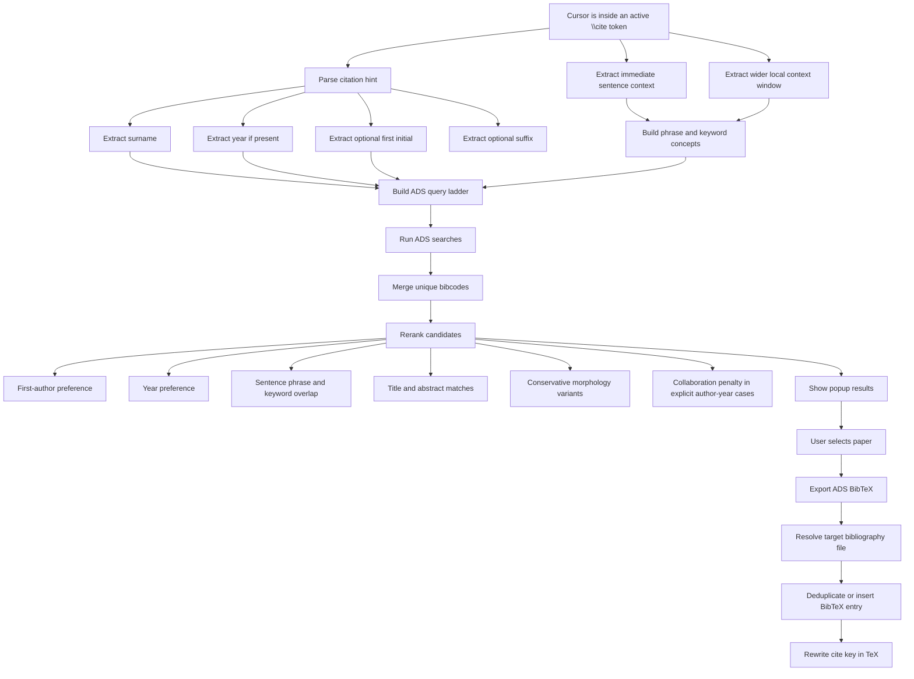

# OverCite Logic Flow

This document gives a visual overview of how OverCite goes from a rough cite token in Overleaf to a selected ADS paper and an updated BibTeX entry.

## Flowchart

## Short Notes

- Immediate sentence context is prioritized over the wider context window.
- Author-year keys such as `Shariat25` and `Cheng25` lead with `first_author + year` queries.
- Surname-only keys such as `El-Badry`, `Li`, and `Perez Paolino` now prefer `first_author` before broader `author` fallbacks.
- Optional first initials such as `LiW25`, `JSmith05`, and `SmithJ05` can narrow common surnames.
- Multi-word surnames such as `Perez Paolino` are supported.
- Conservative morphology expansion helps retrieval for nearby scientific wording such as:
  - `mergers -> merger`
  - `binaries -> binary`
  - `lensing -> lens`
  - `afterglows -> afterglow`
