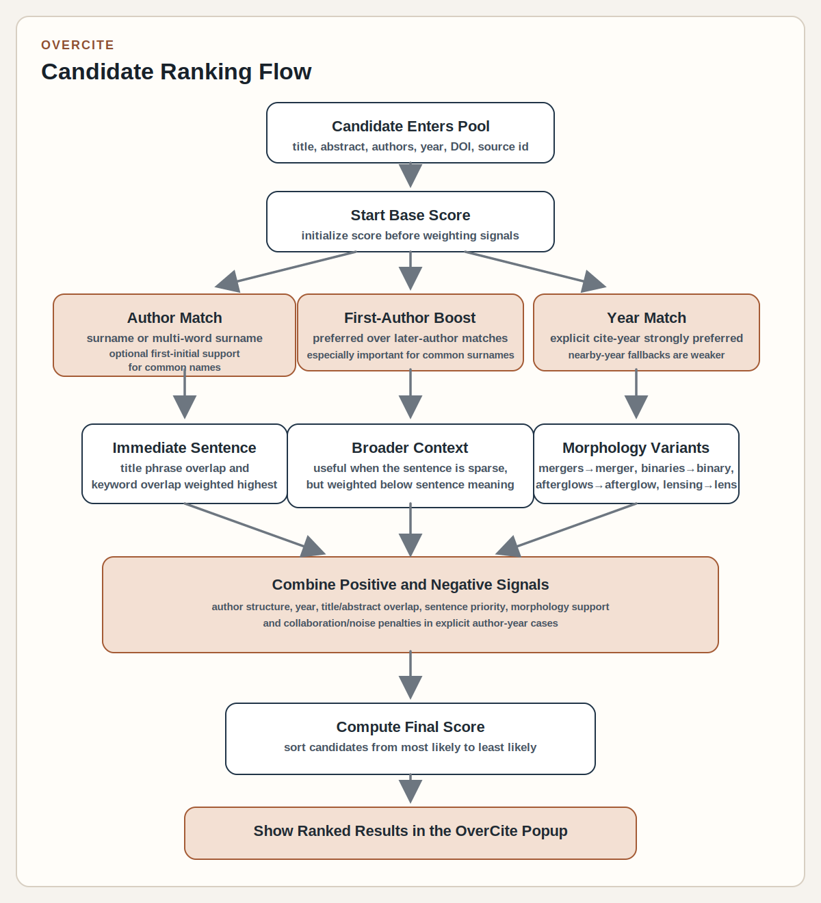

# OverCite Ranking Flow

This document isolates the reranking logic that happens after OverCite has already collected a pool of ADS candidates.

## What This Diagram Emphasizes

- Author structure matters first:
  - exact `first_author` matches get the strongest boost
  - broader `author` matches still help, but less
- Explicit year hints strongly shape ranking when a cite key includes a year such as `Shariat25` or `Cheng25`
- The immediate sentence is the most important local text signal
- Title phrase overlap is stronger than abstract/full-text overlap
- Conservative morphology variants help nearby scientific wording such as:
  - `mergers -> merger`
  - `binaries -> binary`
  - `afterglows -> afterglow`
  - `lensing -> lens`
- Collaboration-style and obviously noisy matches can be pushed down in explicit author-year searches

## Short Notes

- The ranking stage only reorders candidates that were already retrieved from ADS.
- Better query construction still matters, especially for common surnames such as `Li`.
- Optional first initials such as `LiW25`, `JSmith05`, and `SmithJ05` can help disambiguate common surnames before ranking.
